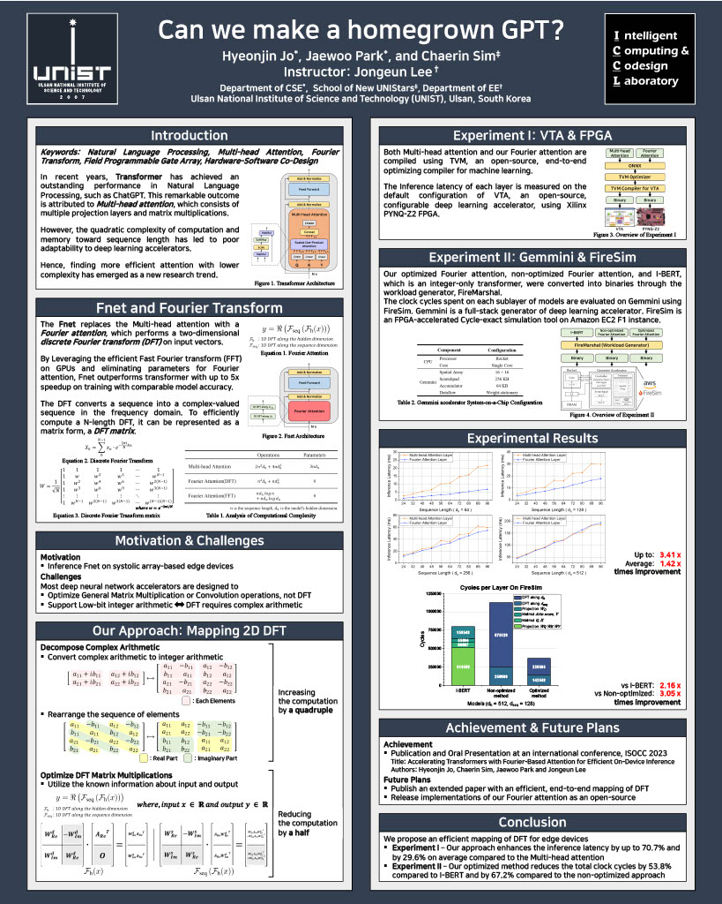

# HardwareAcceleration

### Repository
* (Chipyard) chipyard: Custom Chipyard Configuration. [HJ.scala](chipyard/src/main/scala/config/HJ.scala) and [See other hardware configurations](chipyard/src/main/scala/config)
* (FireSim) firesim_customized_workload_files: Workload files for IBERT, 2D DFT, and 2D DFT with Optimization.
* (FireSim) firesim_build_configurations.
* (FireMarshal) firemarshal_workload_generator_files: Baremetal Workload Generator Files
* archive: poster

### Poster

[download pdf file](archive/poster.pdf)
