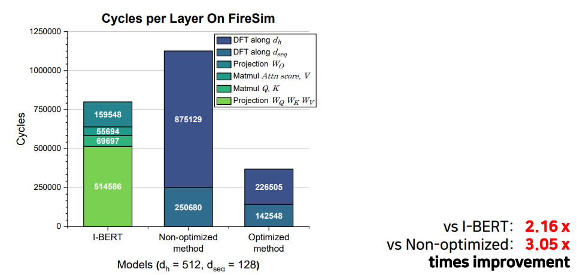

## CUSTOMIZED WORKLOAD FILES

### WORKLOADS
1. IBERT (Kim, Sehoon, et al. "I-bert: Integer-only bert quantization." International conference on machine learning. PMLR, 2021.): IBERT.c & IBERT.h & IBERT_uartlog.txt
2. 2D DFT: twodim_dft.c & twodim_dft.h & twodim_dft_uartlog.txt
3. 2D DFT with Optimization: twodim_dft_w_opt.c & twodim_dft_w_opt.h & twodim_dft_w_opt_uartlog.txt

### Our Approach & Results

